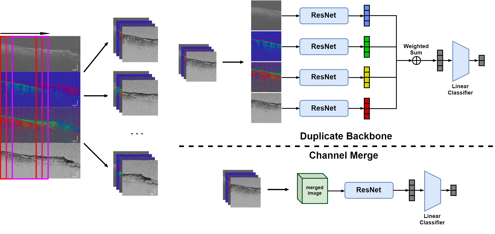

# Deep learning-assisted canine soft tissue sarcoma surgical margin assessment based on polarization-sensitive optical coherence tomography

This repository contains the official PyTorch implementation of the following paper:

> **Deep learning-assisted canine soft tissue sarcoma surgical margin assessment based on polarization-sensitive optical coherence tomography**
> 
> Yuanlong Wang, Laura E. Selmic, Ping Zhang
>
> **Abstract:** Soft tissue sarcomas (STS) are malignant locally aggressive neoplasms arising from mesenchymal cells. The typical treatment for canine STS is surgical removals. While post-operative margin assessment is traditionally used, optical coherence tomography (OCT) has been reported for intra-operative surgical margin assessment. Polarization-sensitive OCT (PS-OCT) has shown the potential to differentiate tissue types in human breast cancer surgical margin imaging. In this paper, we report a method based on deep learning for fast and accurate intra-operative OCT assessment for paired SD-OCT and PS-OCT images. We tested our proposed method on a canine STS surgical margin dataset and the result showed 0.989 Area Under the Receiver Operating Curve (AUROC) and 91\% accuracy in detecting positive margins. We also conducted a case study that used our model to generate diagnosis curves to locate cancerous areas in OCT images. The case study further validates the effectiveness and reliability of our method.

## Framework

We implement models with two fusion strategies to conduct margin assessment for PS-OCT images, namely duplicate backbone and channel merge. Our models are based on ResNet for image feature extractor. Their structures are shown in the figure below.



## Files directory

```
./
│
├─assets    # assets for README.md
├─data      # place to put image files
├─dataset
│  │  __init__.py
│  └─ imgset.py
├─model
│  │  __init__.py
│  └─ ResNet.py          
│  main.py                  # script for classification training and testing
│  PS_image_preprocess.py   # crop images into patches 
│  README.md
└─ test.py                  # generate diagnosis curve 
```

## Requirements
```
Python 3.7
PyTorch 1.13.1
pandas 1.3.5
scikit-learn 1.0.2
```

## Code Usage
**Data is available upon request from the corresponding author**

1. put the original data into `./data/raw_ps`
2. run `PS_image_preprocess.py`
3. run `main.py`, with the following arguments:
```
optional arguments:
  -h, --help            show this help message and exit
  -e EPOCH, --epoch EPOCH
                        number of epoch to train
  -m MODE, --mode MODE  image fusion mode, select from dup_backbone and channel_merge
  -a, --augmentation    use data augmentation method
  --keys KEYS           psoct measurements to use, should be certain combination of "d" for DOPU, "o" for Optial Axis, and "r" for Retardation
```
4. run `test.py` to generate prediction curve for trained models, with the following arguments:
```
  -h, --help            show this help message and exit
  -m MODE, --mode MODE  image fusion mode, select from dup_backbone and channel_merge
  -a, --augmentation    use the model trained with data augmentation method
  --keys KEYS           use the model trained with psoct measurements in KEYS
```